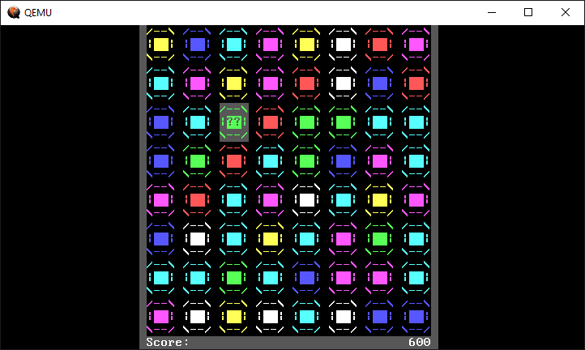
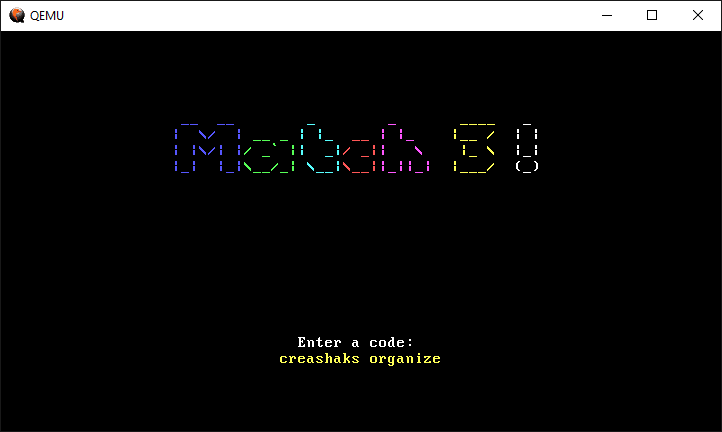

# Match3!


## A `no-std` Rust game for x86-64 CPUs
_Match3!_ is a puzzle game inspired by Bejeweled and written in bare-metal Rust. It is my CSCI 320 midterm project, made in one week (but mostly on Saturday night).

## Setup
Although it should theoretically run on any Intel x86-64 computer, I have had little success in doing so; for best results, run in a Qemu x86-64 emulator:

```
qemu-system-x86_64 -drive format=raw,file=target\x86_64-blog_os\debug\bootimage-csci320-match3.bin
```

Ensure that Qemu is in your PATH and the command is run in the project's root directory.

## How to Play


When the game boots up, the home screen will open. From here, enter a text code up to 80 characters long to generate a procedurally random starting position, then press Enter.

During the game, colored gems will fall from the top of the screen to fill any gaps on the board. If, when the gems settle, there are three or more gems of the same color in a row vertically or horizontally (called a "match"), those gems will disappear and score points. The player can swap any gem with an adjacent one if the swap creates a match. Once there are no more possible matches to make, the game ends.

## Controls
* WASD / Arrow Keys - move the cursor
* Enter / Space - select/deselect a gem; this toggles between cursor mode and swapping mode
* Escape - return to the menu screen; must be pressed twice if the game is not yet over
